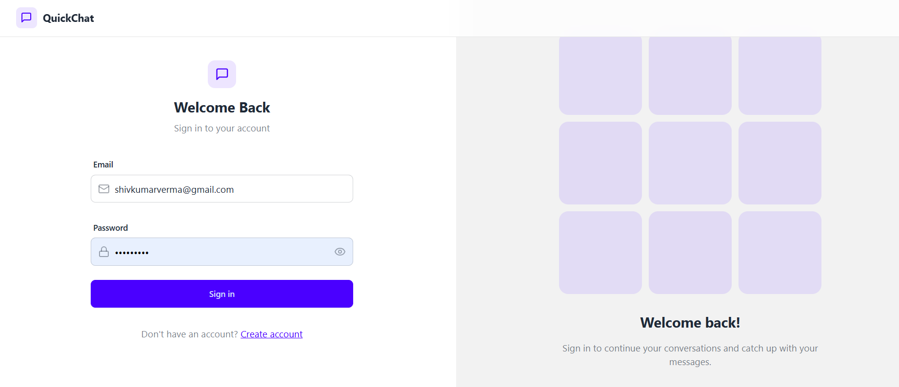
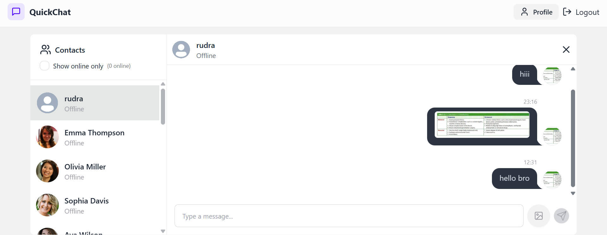
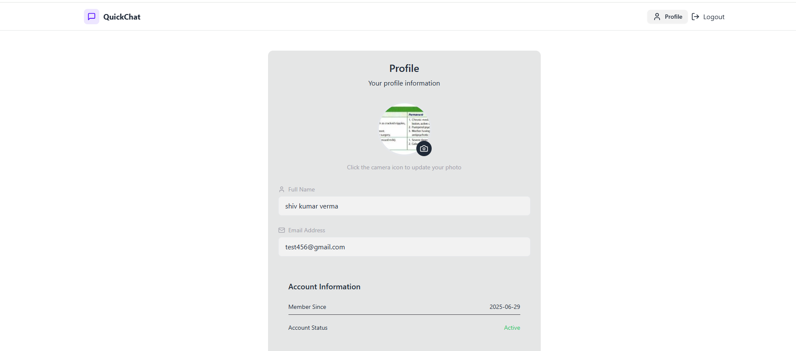

# 💬 Real-Time Chat Application

A modern, real-time chat application built with ❤️ using cutting-edge web technologies. This app supports live messaging, user presence, and sleek UI — perfect for teams and communities.

---

## 🚀 Features

- 🧑‍🤝‍🧑 Real-time 1-on-1 chat
- 🔴 Online/offline user presence
- 📡 WebSocket/Socket.IO based live messaging
- 📷 Image sharing
- 🔒 JWT-based authentication
- 📱 Fully responsive UI

---

## 🖼️ Screenshots

### 🔐 Login 

### 🔐 Sign Up  

### 💬 Chat Interface  

### 🧖‍♂️ profile  

---

## 🛠️ Tech Stack

| Frontend     | Backend     | Real-Time | Authentication | Database  |
|--------------|-------------|-----------|----------------|-----------|
| React.js     | Node.js     | Socket.IO | JWT            | MongoDB   |
| Tailwind CSS | Express.js  | WebSocket | bcrypt.js      | Mongoose  |

---

## 📁 Project Structure
Etalks/
└── fullstack-chat-app/
├── backend/
│ └── src/
│ ├── controllers/
│ ├── lib/
│ ├── middleware/
│ ├── models/
│ ├── routes/
│ └── seeds/
├── frontend/
│ ├── public/
│ ├── src/
│ │ ├── components/
│ │ │ └── skeletons/
│ │ ├── lib/
│ │ ├── pages/
│ │ └── store/
└── screenshots/
